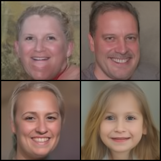
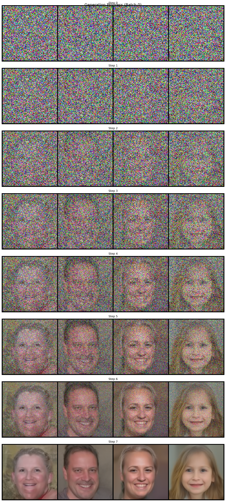
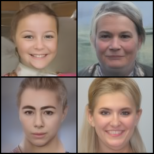
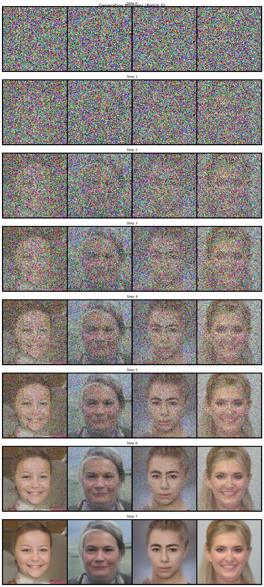

# Conditional Flow Matching: Optimal Transport Implementation

## 🚀 Overview
This project implements Conditional Flow Matching (CFM) with a focus on Optimal Transport Conditional Flow Matching (OTCFM), providing a flexible framework for generative modeling.

## 📄 Research Papers
- [Flow Matching for Generative Modeling](https://arxiv.org/pdf/2210.02747)
- [Rectified Flows: A Probabilistic Flow Model](https://arxiv.org/pdf/2209.03003)

## 🔍 Helpful Resources
### Technical Blogs
1. [Flow Matching Explanation by Tomczak](https://jmtomczak.github.io/blog/18/18_fm.html)
2. [Cambridge MLG Flow Matching Blog](https://mlg.eng.cam.ac.uk/blog/2024/01/20/flow-matching.html)
3. [Rectified Flows Introduction](https://www.cs.utexas.edu/~lqiang/rectflow/html/intro.html)

## ✨ Features
- Optimal Transport Conditional Flow Matcher (OTCFM)
- Independent Conditional Flow Matcher (ICFM)
- EMA (Exponential Moving Average) model tracking
- TensorBoard logging
- Flexible sampling methods (Euler and Heun solvers)

## 🛠 Installation & Setup

### Prerequisites
- Python 3.8+
- CUDA-compatible GPU (recommended)
- Git

### Installation Steps
```bash
# Clone the repository
git clone https://github.com/Thehunk1206/flow-based-models.git
cd flow-based-models

# Create and activate a virtual environment (optional but recommended)
python -m venv venv
source venv/bin/activate  # Linux/Mac
# or
.\venv\Scripts\activate  # Windows

# Install dependencies
pip install -r requirements.txt
```

## 🚀 Training Models

### Basic Training Command
```bash
python train_cfm.py \
    --model "otcfm" \
    --lr 1e-4 \
    --batch_size 16 \
    --total_steps 1000000 \
    --output_dir "outputs/otcfm_default" \
    --log_dir "logs/otcfm_default" \
    --save_step 5000 \
    --warmup 20000
```

### Training Parameters
- `--model`: Model type (`otcfm` or `icfm`)
- `--lr`: Learning rate
- `--batch_size`: Batch size for training
- `--total_steps`: Total training steps
- `--output_dir`: Directory for saving model checkpoints
- `--log_dir`: Directory for TensorBoard logs
- `--save_step`: Frequency of saving checkpoints
- `--warmup`: Number of warmup steps

## 🎨 Generating Samples

### Basic Sample Generation Command
```bash
python generate_samples.py \
    --checkpoint "outputs/results_otcfm_32_otcfm-large-batch_exp/otcfm/otcfm_weights_step_2000000.pt" \
    --num_samples 4 \
    --batch_size 4 \
    --output_dir "sample_ot-cfm_large_batch" \
    --image_size 128 128 \
    --num_steps 8 \
    --use_ema \
    --solver heun \
    --save_grid \
    --save_intermediates \
    --intermediate_freq 1
```

### Generation Parameters
- `--checkpoint`: Path to the model checkpoint
- `--num_samples`: Number of samples to generate
- `--batch_size`: Batch size for generation
- `--output_dir`: Output directory for generated samples
- `--image_size`: Size of generated images (height width)
- `--num_steps`: Number of steps in the generation process
- `--use_ema`: Use EMA weights for generation
- `--solver`: Solver type (`euler` or `heun`)
- `--save_grid`: Save samples in a grid format
- `--save_intermediates`: Save intermediate generation steps
- `--intermediate_freq`: Frequency of saving intermediates generations


## 🔬 Experiment Configuration

### Automated Experiment Runner
The project includes `experiment_runner.sh` for automated experiment execution and tracking.

```bash
# Make script executable
chmod +x experiment_runner.sh

# Run all experiments
./experiment_runner.sh
```

### Default Experiments

1. **OTCFM Default**
```bash
Model: otcfm
Learning Rate: 1e-4
Batch Size: 16
Total Steps: 2,000,000
```

2. **OTCFM Large Batch**
```bash
Model: otcfm
Learning Rate: 1e-4
Batch Size: 32
Total Steps: 2,000,000
```

3. **ICFM Default**
```bash
Model: icfm
Learning Rate: 1e-4
Batch Size: 16
Total Steps: 2,000,000
```

### Features
- Experiment tracking via `completed_experiments.log`
- Automatic resume of interrupted experiments
- Individual output/log directories per experiment
- Error handling and status reporting

### Customizing Experiments
Add new experiments by modifying `experiment_runner.sh`:
```bash
run_experiment "model_type" "learning_rate" "batch_size" "total_steps" "experiment_name"
```

### Directory Structure
```
./
├── outputs/                 # Model checkpoints
│   └── results_*_exp/
├── logs/                   # Training logs
│   └── *_logs/
└── completed_experiments.log
```


## 📊 Experimental Results

### Model Comparison Study


### Model Variants and Sample Outputs

#### 1. Independent CFM (ICFM) Default Configuration




#### 2. Optimal Transport CFM (OT-CFM) Default Configuration




#### 3. OT-CFM Large Batch Configuration


## 🤝 Contributing
We welcome contributions! Please feel free to submit a Pull Request.

## 📜 License
[Add your license here]

## 🎉 Acknowledgments
- Original Flow Matching Paper Authors
- PyTorch Community
- Open-source Generative Modeling Researchers